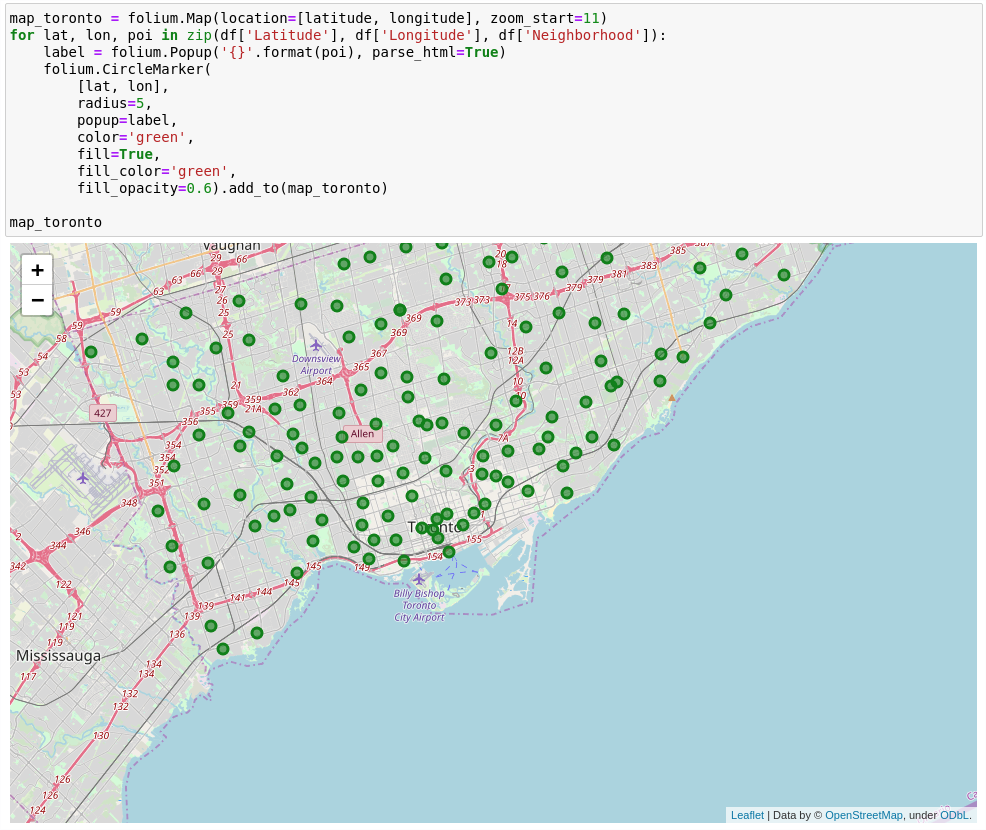
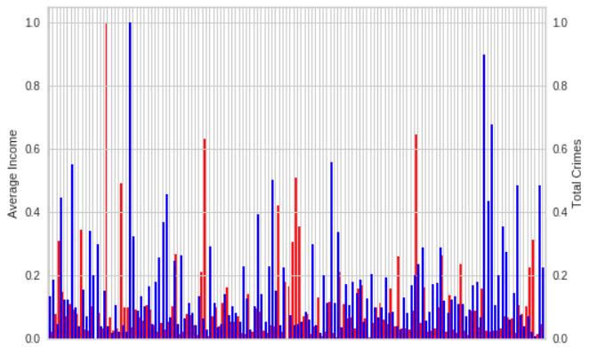
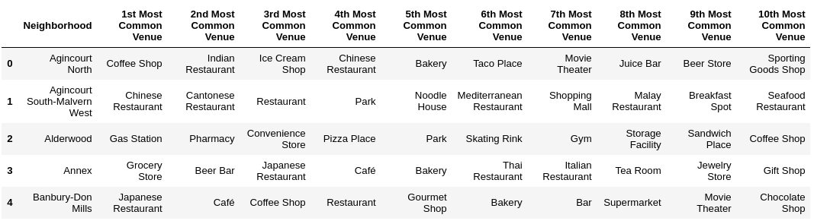
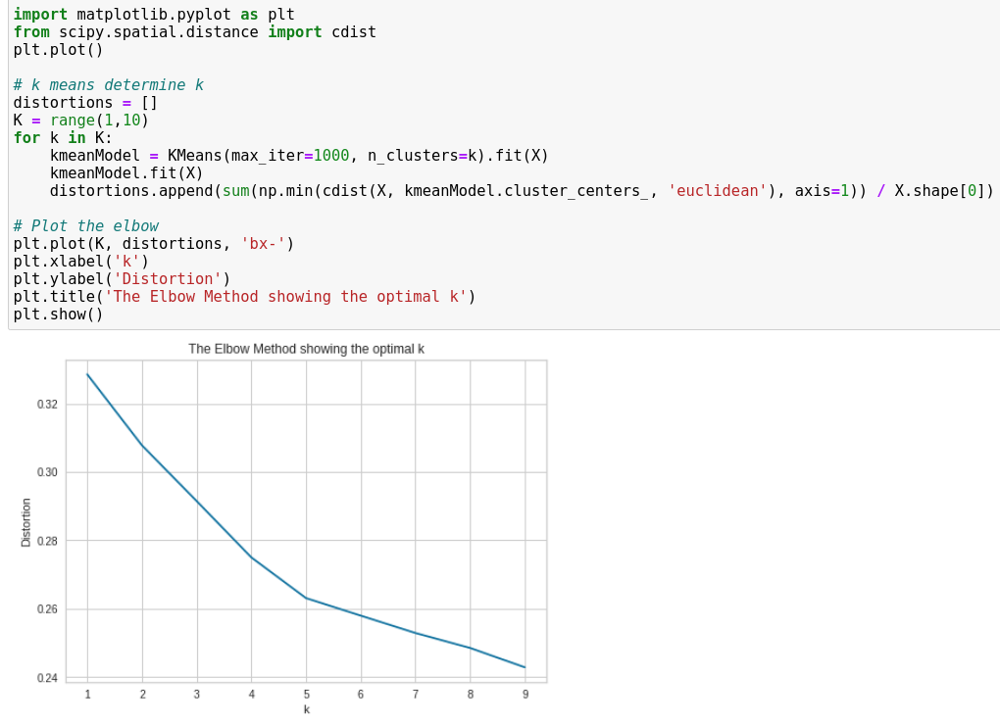
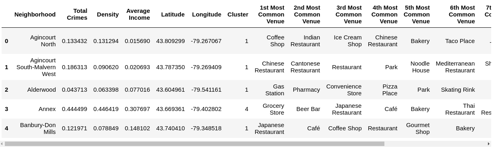
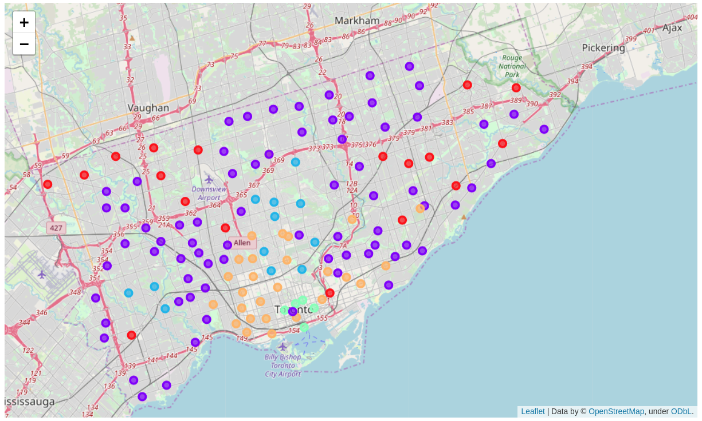
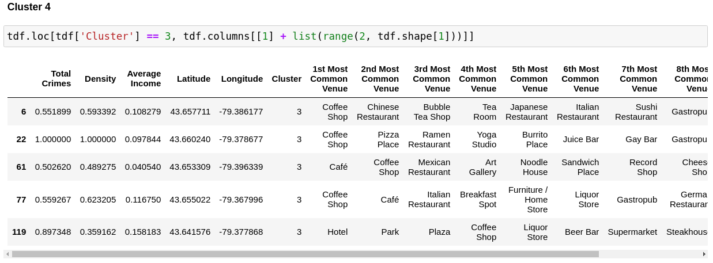

# Applied Data Science Capstone Project

## Introduction/Business Problem

### Problem Description
Toronto is an important dynamic metropolis and the largest city in Canada. Its economic strength makes this city 
very attractive for investors.  

This project investigates where in Toronto an investment in apartments or real estate could be most sensible.
The apartments should have a high standard and be rented to wealthy customers. For this an environment 
characterised by low crime rates, high social status and sufficient cultural and entertainment opportunities 
is suitable.  

To identify these locations, the neighborhoods of Toronto are analyzed using different datasets containing information 
about the above mentioned characteristics.  

### Target Audience
The target group of this project are private and commercial investors who think about buying buy real estate in Toronto.
The investigations made in this project help the target group to find suitable locations and objects for investments.

## Data

### Data Sources

Different data sources are used to get enough information for decision building. These sources include:

* Toronto Crime Data:  
Major Crime Indicators (MCI) from the years 2014 to 2018 (downloaded from http://data.torontopolice.on.ca). This dataset
includes information of all recorded crime incidents of the categories Assault, Break and Enter, Robbery, Auto Theft an Theft Over.
Each incidents also includes coordinates (latitude and longitude), date, neighborhood and others.  
To simplify the process, all crimes in a neighborhood will be summed up and only the total crime rate will be considered.
But this value will provide sufficient information about the security of a district or neighborhood.

* Demographic Data:  
This dataset contains demographic information about the neighborhoods in Toronto and is loaded 
from https://open.toronto.ca/dataset/neighbourhood-profiles/.
Data like population, average income, density (people/km²) or transit commuting is provided.  
Interesting for a high-quality living ambiance are especially the average income and the density of the neighborhoods.

* Venue Data:  
The Foursquare API (https://developer.foursquare.com) is used to explore information about available venues in the 
neighborhoods provided by the other datasets.
For each neighborhood in Toronto details about available venues including their names, categories and locations are fetched.
 
Before continuing the datasets are cleaned, e. g. not all venue categories are considered. After that the different sets
are combined into one dataset for further processing and analysis steps.

### Data Wrangling

The sources given above cannot be used directly, i.e. cleaning and manipulation of the data is needed.

#### Loading and Cleaning of Crime and Demographic Data

The crime dataset contains information about distinct incidents. To get the total number of incidents per neighborhood, 
the 'groupby' and 'count' functions of the Pandas dataframe are used. The neighborhood column includes an ID in brackets
which will be removed. Also the neighborhood names will be trimmed as they contain empty spaces.

```
df_crime = pd.read_csv('MCI_2014_to_2018.csv')
df_crime.rename(columns={"Neighbourhood": "Neighborhood"}, inplace=True)
df_crime['Neighborhood'] = df_crime.Neighborhood.str.split("(", expand=True)
# move neighborhood column to the first column
df_crime = df_crime[ ['Neighborhood'] + [ col for col in df_crime.columns if col != 'Neighborhood' ] ]
df_crime_total = df_crime.groupby('Neighborhood').count()[['MCI']]
df_crime_total.reset_index(drop=False, inplace=True)
df_crime_total.rename(columns={"MCI": "Total Crimes"}, inplace=True)
df_crime_total = df_crime_total.applymap(lambda x: x.strip() if isinstance(x, str) else x)
```

The demographic data is loaded with the 'read_csv' function from the Pandas package. As the neighborhoods are encoded in columns,
the dataset has to be transposed. Columns not interesting for the project are dropped. Long names are renamed for simplicity.  

```
df_demo = pd.read_csv('neighbourhood-profiles-2016.csv')
df_demo.drop(['_id', 'Category', 'Topic', 'Data Source'], axis=1, inplace=True)
df_demo.head()
t = df_demo.transpose()
t.columns = t.iloc[0]
t.drop(t.index[0], inplace=True)
t.reset_index(drop=False, inplace=True)
t.rename(columns={"index": "Neighborhood"}, inplace=True)
t.columns.name = ''
t = t[['Neighborhood', 'Population density per square kilometre',
       'Total income: Average amount ($)']]
t.rename(columns={"Population density per square kilometre": "Density",
                  "Total income: Average amount ($)": "Average Income"}, inplace=True)

```

Afterwards the datasets are merged:
```
merged = df_crime_total
merged = merged.join(t.set_index('Neighborhood'), on='Neighborhood')
```

#### Adding Geolocations

Longitude and Latitude for each neighborhood are added with the geopy package and the Nomatim geocoder:
```
from geopy.extra.rate_limiter import RateLimiter
geocode = RateLimiter(locator.geocode, min_delay_seconds=1, max_retries=4)
df = import_csv
df['location'] = df['Neighborhood'].apply(geocode)
df['point'] = df['location'].apply(lambda loc: tuple(loc.point) if loc else None)
```
As some neighborhoods are misinterpreted these have to be fixed by hand (e.g. Blake-Jones was assumed to be in Florida).

#### Venue Data

With the coordinates from the step above interesting venues with a radius of 1000 m are fetched from the Foresquare API 
(see https://developer.foursquare.com/docs/api for details). For this the exploration endpoint ('https://api.foursquare.com/v2/venues/explore') is used.

## Methodology

### Exploratory Analysis

To explore the used data in the first step a map is drawn with to get an overview of the neighborhoods of Toronto.



To get an overview of the distribution of average incomes and total crimes accoss the neighborhoods a bar chart is used.



Some outliers can be seen in both income and total crimes. This information could be used later on to decide in which neighborhood to invest.

To be able to segmentate the neighborhood venues the top ten venues are collected for each neighborhood.
A sample of the result can be seen below.



### Clustering Neighborhoods

For a segmentation of the neighborhoods k-means clustering is used. Alongside the above mention income and crime rate statistics, 
the venue data from Foresquare will be used in the clustering process. To be able to use the venue data it is one-hot encoded
with ```get_dummies``` method of Pandas.

To determine the optimal value for K the elbow method is used. See a code snippet and the outcome below:



It can be seen in the chart that a value of 5 seems to be the best for the K-Means algorithm.
So the clustering is executed with K = 5. The cluster labels are inserted in the main dataset containing all relevant data,
an excerpt is shown below.

 

## Results

The clusters with their neighborhoods are displayed in a Folium map below. It can be seen that some of the clusters can
be recognized by their location.



By examining the clusters some conclusions can be drawn.  
In the following image the fourth cluster is displayed as an example. The high crime rates and density of the 
neighborhoods contained in this cluster attract attention.



Analysing the clusters one by one leads to the following short descriptions of them. In the follwoing the expressions 
'low', 'high' etc. are relative for the neighborhoods of Toronto, not for the whole country of Canada.

* Cluster 1: High crime rate, low income, mid to low density and lot of lower priced food venues. Located mainly north-west and east of center.

* Cluster 2: Moderate crime rate, low income, mid to low density and mostly food and recreational venues (parks etc.). Spread across city excluding the center.

* Cluster 3: Low crime rate, high income, low density, more exclusive food and recreational venues (Sushi, Spa etc.) and some expensive stores. Located west and in the middle of town.

* Cluster 4: High crime rate, mid income, high density and a lot of cafés and coffee shops as well food venues. Located near the waterfront in the very center of the town.

* Cluster 5: Mixed crime rate and mixed income, high density. Mainly food venues. Located in the center. 

So based on the available data and the methods used in this project, the neighborhoods in the clusters 3 and 5 (especially 3) seem to
be promising targets for real estate investments. But it must be said that the analysis made here is only a first
entry point for a truly sound analysis for real investments.  

## Discussion and Conclusion

This capstone project targets the use of data scientific methods to identify possible locations for real estate investments 
in the town of Toronto, Canada. Trying to follow a structured approach, the first step of business understanding includes 
the description of the business problem and the target audience. The next step describes the data sources used and the data wrangling steps 
to get a good basis for data science methods used later on. This is followed by an exploratory analysis to get more insight 
into the dataset. Finally a clustering is performed to be able to segment the neighborhoods by criteria such as income, 
crime rate and cultural offerings. The resulting clusters are visualized and their characteristics are described.

Two of the five found clusters seem to be promising for real estate investments but further analysis with more data has
to be carried out. One drawback of the data used is that the demographic data origins from the year 2016 which is somewhat old.
More actual data is desired as well as additional data regarding actual real estate prices and trends.

To conclude this report the capstone project offers the author the chance to try out and deepen his newly acquired knowledge about data science. 
Different methods for data wrangling, exploration, analysis and visualization are used and tested.